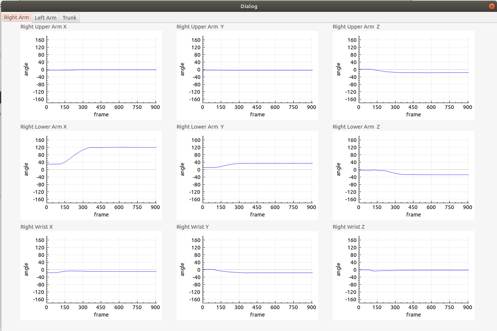
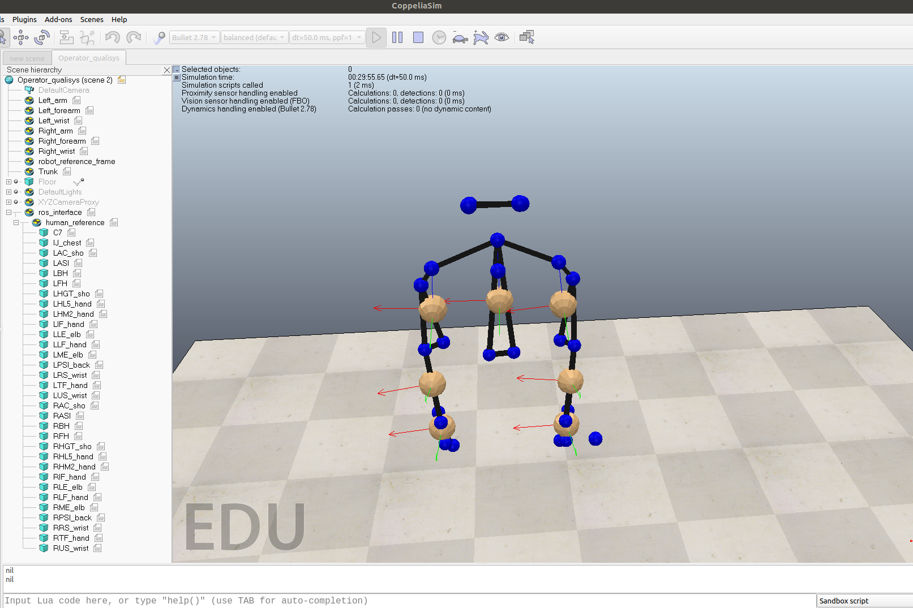

# Qualysis Human Joint Angles Computation

This project provides software for calculating the upper body joint angles of human models from 3D positional data captured with the Qualisys motion capture system.
The algorithm was developed in C++, using the Qt Creator IDE.

## Pre Requisites 
- Operating System: Linux (Ubuntu 18/20)
- ROS
- CoppelliaSim
- QtCreator

## Installation

- Create a ROS workspace in the home directory and place the downloaded src folder inside it.
- Open a terminal and execute: $catkin_make.
- Create a ROS project in QtCreator and set the newly created ROS workspace as the project workspace.

## Execution

- Launch CoppeliaSim and open the scenario qualysis_scene.ttt, present in the project folder.
- In the ROS workspace, open a terminal and execute the following:
    - $ source devel/setup.bash
    - $ rosrun qualysis_data qualysis_data 

---

## System Overview

* Motion capture is performed using the **Qualisys system**. 
* Captured data is stored in **TSV files**. 
* The developed software processes this data to extract the **3D coordinates of each Qualisys marker**. 
* Using the marker coordinates, the software computes the **body segment planes**. 
  The markers required to define each body segment are listed in the following table: 

### Body Segments and Markers
| Body Segment       | Marker Names |
| ------------------ | -------------------------------- |
| Right Arm          | RLE_elb, RME_elb, RAC_sho |
| Right Forearm      | RUS_wrist, RRS_wrist, RLE_elb | 
| Right Wrist        | RHM2_hand, RHL5_hand, RUS_wrist, RRS_wrist |
| Left Arm           | LLE_elb, LME_elb, LAC_sho |
| Left Forearm       | LUS_wrist, LRS_wrist, LLE_elb |
| Left Wrist         | LHM2_hand, LHL5_hand, LUS_wrist, LRS_wrist |
| Trunk              | RPSI_back, LPSI_back, C7 |

* For each body segment, the software defines a **Cartesian reference frame**, following the **Right-Hand Rule**, as illustrated in the avatar model within **CoppeliaSim**. 

* The software then computes the **joint angles** by comparing **two consecutive Cartesian reference frames**. 
  The corresponding definitions are summarized in the following table: 

### Joints and Reference Frames
| Joint              | Cartesian Reference Frames |
| ------------------ | --------------------------- |
| Right Shoulder     | Trunk , Right Arm |
| Right Elbow        | Right Arm , Right Forearm | 
| Right Wrist        | Right Forearm , Right Wrist |
| Left Shoulder      | Trunk , Left Arm |
| Left Elbow         | Left Arm , Left Forearm |
| Left Wrist         | Left Forearm , Left Wrist |
| Trunk              | World Scenario , Trunk |

* The **time evolution of the joint angles** is displayed in plots and exported as **TXT reports**. 

<p align="center">
  
</p>

* Movements can also be **replicated in CoppeliaSim** through a human avatar. 
* Communication with CoppeliaSim is handled via **ROS**. 

<p align="center">
  
</p>

---
```

👉 Quer que eu também adicione **subtítulos (###)** para as partes *plots* e *avatar replication*, para ficar ainda mais organizado e navegável?

